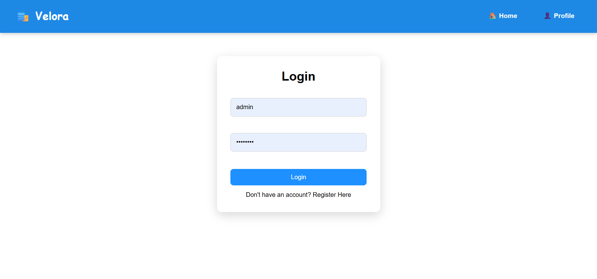
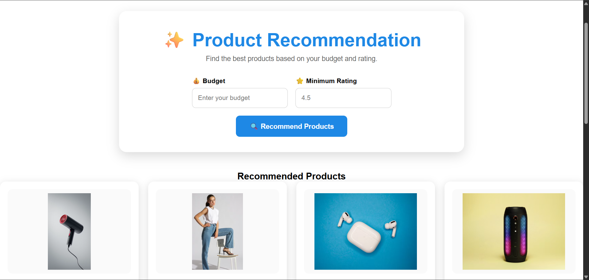

# 🛍️ AI-Powered E-Commerce Recommendation Engine

An intelligent e-commerce web application that recommends products using Machine Learning. The project combines **Flask**, **Python**, and **Logistic Regression** to provide personalized product recommendations based on customer information.

---

## 📌 Project Overview

The AI-Powered E-Commerce Recommendation Engine is designed to improve the online shopping experience by predicting customer purchase behavior and recommending suitable products.

This project was developed as a **college mini project** to demonstrate the integration of **Machine Learning** with a **Flask web application**.

---

## ✨ Features

- 🏠 Responsive Home Page
- 👤 User Registration
- 🔐 User Login
- 🛒 Product Listing
- 🤖 Machine Learning Recommendation
- 📊 Customer Purchase Prediction
- 🛍 Shopping Cart
- 📱 Responsive UI
- 📂 Product Dataset Integration

---

## 🛠️ Technologies Used

### Frontend

- HTML5
- CSS3
- JavaScript

### Backend

- Python
- Flask

### Machine Learning

- Scikit-Learn
- Pandas
- NumPy
- Logistic Regression

### Database

- CSV Dataset

---

## 🤖 Machine Learning Model

Algorithm Used:

- Logistic Regression

### Model Workflow

Customer Data
⬇
Data Preprocessing
⬇
Model Training
⬇
Prediction
⬇
Product Recommendation

---

## 📂 Project Structure

```text
AI-Recommendation-Engine/
│
├── static/
│   ├── css/
│   ├── images/
│
├── templates/
│   ├── home.html
│   ├── login.html
│   ├── register.html
│   ├── products.html
│   ├── recommendation.html
│   ├── cart.html
│
├── data/
│   ├── customers.csv
│   ├── products.csv
│
├── models/
│   ├── train_logistic.py
│
├── saved_models/
│   ├── logistic_model.pkl
│
├── app.py
├── requirements.txt
└── README.md
```

---

## 📊 Dataset

The recommendation model was trained using customer information such as:

- Age
- Income
- Previous Purchases
- Time Spent
- Category Viewed
- Purchase Amount

Target Variable:

- Purchased

---

## 🚀 Installation

Clone the repository

```bash
git clone https://github.com/priyamanogaran-codes/ai-recommendation-engine.git
```

Move into the project

```bash
cd ai-recommendation-engine
```

Install dependencies

```bash
pip install -r requirements.txt
```

Run the application

```bash
python app.py
```

Open your browser

```
http://127.0.0.1:5000
```

---

## 📸 Screenshots

### 🏠 Home Page


### 🔐 Login Page



### 🛒 Products Page


### 🤖 Recommendation Page



---

## 🎯 Future Enhancements

- Collaborative Filtering
- Deep Learning Recommendation System
- Payment Gateway
- Wishlist
- Admin Dashboard
- MySQL Database
- Product Search
- User Profile Management

---

## 👩‍💻 Author

### Priya Dharshini

Python Developer | AI & Machine Learning Enthusiast | Frontend Developer

📧 Email

priyamanogaran445@gmail.com

💻 GitHub

https://github.com/priyamanogaran-codes

🔗 LinkedIn

https://www.linkedin.com/in/priya-manogaran-6b9a7b351

---

## ⭐ Support

If you like this project, consider giving it a ⭐ on GitHub.

It motivates me to build more AI-powered applications.
